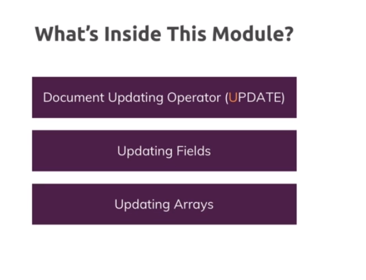

# 6-Update-Operations

1. [Intro](#schema1)
2. [Updating Fields with "updateOne()", "updateMany()" and "$set"](#schema2)
3. [Incrementing & Decrementing Values](#schema3)
4. [Using $min, $max and $mul](#schema4)
5. [Getting Rid of Fields and Renaming Fields](#schema5)
6. [Undestanding "upsert()"](#schema6)
7. [Updating Matched Array Elements](#schema7)


<hr>

<a name="schema1"></a>

## 1. Intro



<hr>

<a name="schema2"></a>

## 2. Updating Fields with "updateOne()", "updateMany()" and "$set"

- updateOne()

La sintaxis básica de updateOne() es la siguiente:

``` 
db.collection.updateOne(
  { /* Filtro */ },
  { $set: { /* Nuevos valores */ } }
);
```

Donde:

- collection: Es el nombre de la colección en la que deseas realizar la actualización.
- Filtro: Es la condición que determina qué documento(s) se actualizarán.
- $set: Es un operador de actualización que especifica los nuevos valores que se deben asignar al documento.

```
users> db.persons.updateOne({_id:ObjectId('6567259ef5d66fd59e935429')},{$set:{hobbies:[{title:'Sports',frequency:5},{title:'Cooking',frequency:3},{title:'Hiking',frequency:1}]}})
{
  acknowledged: true,
  insertedId: null,
  matchedCount: 1,
  modifiedCount: 1,
  upsertedCount: 0
}
users> db.persons.find()
[
  
  {
    _id: ObjectId('6567259ef5d66fd59e935429'),
    name: 'Chris',
    hobbies: [
      { title: 'Sports', frequency: 5 },
      { title: 'Cooking', frequency: 3 },
      { title: 'Hiking', frequency: 1 }
    ]
  }
]

```

- updateMany()
```
users> db.persons.updateMany({"hobbies.title":"Sports"},{$set:{isSport:true}})
{
  acknowledged: true,
  insertedId: null,
  matchedCount: 3,
  modifiedCount: 3,
  upsertedCount: 0
}
users> db.persons.find({"hobbies.title":"Sports"})
[
  {
    _id: ObjectId('6567259ef5d66fd59e935426'),
    name: 'Max',
    hobbies: [
      { title: 'Sports', frequency: 5 },
      { title: 'Cooking', frequency: 3 },
      { title: 'Hiking', frequency: 1 }
    ],
    phone: 131782734,
    isSport: true
  },
  {
    _id: ObjectId('6567259ef5d66fd59e935428'),
    name: 'Anna',
    hobbies: [
      { title: 'Sports', frequency: 2 },
      { title: 'Yoga', frequency: 3 }
    ],
    phone: '80811987291',
    age: null,
    isSport: true
  },
  {
    _id: ObjectId('6567259ef5d66fd59e935429'),
    name: 'Chris',
    hobbies: [
      { title: 'Sports', frequency: 5 },
      { title: 'Cooking', frequency: 3 },
      { title: 'Hiking', frequency: 1 }
    ],
    isSport: true
  }
]

```
```
users> db.persons.updateOne({_id:ObjectId('6567259ef5d66fd59e935429')},{$set:{age:40,phone:1233456 }})
{
  acknowledged: true,
  insertedId: null,
  matchedCount: 1,
  modifiedCount: 1,
  upsertedCount: 0
}
{
    _id: ObjectId('6567259ef5d66fd59e935429'),
    name: 'Chris',
    hobbies: [
      { title: 'Sports', frequency: 5 },
      { title: 'Cooking', frequency: 3 },
      { title: 'Hiking', frequency: 1 }
    ],
    isSporty: true,
    age: 40,
    phone: 1233456
  }
]

```

<hr>

<a name="schema3"></a>

## 3. Incrementing & Decrementing Values

- Incrementing
Incrementa la edad en 1
```
db.persons.updateOne({name:'Manuel'},{$inc:{age:1}})
```
- Decrementig

Poniendo el `-2` decrementa el valor de age.


```
db.persons.updateOne({name:'Manuel'},{$inc:{age:-2},$set:{isSporty:false}})

```

<hr>

<a name="schema4"></a>

## 4. Using $min, $max and $mul

### Min
Tenemos:

```
{
    _id: ObjectId('6567259ef5d66fd59e935429'),
    name: 'Chris',
    hobbies: [
      { title: 'Sports', frequency: 5 },
      { title: 'Cooking', frequency: 3 },
      { title: 'Hiking', frequency: 1 }
    ],
    isSporty: true,
    age: 40,
    phone: 1233456

```
Ejecutamos la sentencia:

```
db.persons.updateOne({name:'Chris'},{$min:{age:35}})
 {
    _id: ObjectId('6567259ef5d66fd59e935429'),
    name: 'Chris',
    hobbies: [
      { title: 'Sports', frequency: 5 },
      { title: 'Cooking', frequency: 3 },
      { title: 'Hiking', frequency: 1 }
    ],
    isSporty: true,
    age: 35,
    phone: 1233456
  }
```
Como podemos ver el valor de age ha cambiado a 35.
Pero si ejecutamos:
```
users> db.persons.updateOne({name:'Chris'},{$min:{age:38}})
{
  acknowledged: true,
  insertedId: null,
  matchedCount: 1,
  modifiedCount: 0,
  upsertedCount: 0
}
```
Vemos que no se ha modificadon nada, esto pasa porque la acción `$min` solo modifica el dato cuando el dato que se va 
a agragar es menor que el que esta.


### Max
Lo mismo pasa con `$max` que solo modifica el dato cuando el valor que se va añadir es mayor que el que está.
```
users> db.persons.updateOne({name:'Chris'},{$max:{age:38}})
{
  acknowledged: true,
  insertedId: null,
  matchedCount: 1,
  modifiedCount: 1,
  upsertedCount: 0
}
users> db.persons.find()
 
  {
    _id: ObjectId('6567259ef5d66fd59e935429'),
    name: 'Chris',
    hobbies: [
      { title: 'Sports', frequency: 5 },
      { title: 'Cooking', frequency: 3 },
      { title: 'Hiking', frequency: 1 }
    ],
    isSporty: true,
    age: 38,
    phone: 1233456
  }
]
users> 

```
### Multi

```
users> db.persons.updateOne({name:'Chris'},{$mul:{age:1.1}})
{
  acknowledged: true,
  insertedId: null,
  matchedCount: 1,
  modifiedCount: 1,
  upsertedCount: 0
}
users> db.persons.find()
  
  {
    _id: ObjectId('6567259ef5d66fd59e935429'),
    name: 'Chris',
    hobbies: [
      { title: 'Sports', frequency: 5 },
      { title: 'Cooking', frequency: 3 },
      { title: 'Hiking', frequency: 1 }
    ],
    isSporty: true,
    age: 41.800000000000004,
    phone: 1233456
  }
]

```
<hr>

<a name="schema5"></a>

## 5. Getting Rid of Fields and Renaming Fields

Cuando queremos eliminar un valor de la colección.

Primera opción usando `$set`

```
db.persons.updateMany({isSporty: true},{$set:{phone: null}})
{
    _id: ObjectId('6567259ef5d66fd59e935429'),
    name: 'Chris',
    hobbies: [
      { title: 'Sports', frequency: 5 },
      { title: 'Cooking', frequency: 3 },
      { title: 'Hiking', frequency: 1 }
    ],
    isSporty: true,
    age: 41.800000000000004,
    phone: null
  }
```
Esta opción es la correcta porque sigue aparenciendo el valor aunque sea nulo.

Mejor así:
```
users> db.persons.updateMany({isSporty: true},{$unset:{phone: ""}})
{
  acknowledged: true,
  insertedId: null,
  matchedCount: 3,
  modifiedCount: 3,
  upsertedCount: 0
}
users> db.persons.find()
  {
    _id: ObjectId('6567259ef5d66fd59e935429'),
    name: 'Chris',
    hobbies: [
      { title: 'Sports', frequency: 5 },
      { title: 'Cooking', frequency: 3 },
      { title: 'Hiking', frequency: 1 }
    ],
    isSporty: true,
    age: 41.800000000000004
}
```
### Renaming

```
users> db.persons.updateMany({},{$rename:{age:'TotalAge'}})
{
  acknowledged: true,
  insertedId: null,
  matchedCount: 4,
  modifiedCount: 3,
  upsertedCount: 0
}
users> db.persons.find()
  {
    _id: ObjectId('6567259ef5d66fd59e935427'),
    name: 'Manuel',
    hobbies: [
      { title: 'Cooking', frequency: 5 },
      { title: 'Cars', frequency: 2 }
    ],
    phone: '012177972',
    isSporty: false,
    TotalAge: 33
  },


```
<hr>

<a name="schema6"></a>

## 6. Undestanding "upsert()"

```
users> db.persons.updateOne({name:'Maria'},{$set:{age:29, hobbies:[{title:'Good food', frequency: 3}],isSporty:true}})
{
  acknowledged: true,
  insertedId: null,
  matchedCount: 0,
  modifiedCount: 0,
  upsertedCount: 0
}
```
No añade ni modifica nada porque le estamos pasando un nombre que no existe en la colección e intentando 
hacer un updateOne().
Pero usando `upsert:true` que por defecto siempre está a false. Crea e inserta los datos.
upsert es una combinación entre update e insertar, es decir, si está se modifica y si no está se crea.
```
db.persons.updateOne({name:'Maria'},{$set:{age:29, hobbies:[{title:'Good food', frequency: 3}],isSporty:true}},{upsert:true})
{
  acknowledged: true,
  insertedId: ObjectId('656755d39afc3679dfa0514b'),
  matchedCount: 0,
  modifiedCount: 0,
  upsertedCount: 1
}
 {
    _id: ObjectId('656755d39afc3679dfa0514b'),
    name: 'Maria',
    age: 29,
    hobbies: [ { title: 'Good food', frequency: 3 } ],
    isSporty: true
  }

```

<hr>
<a name="schema7"></a>

## 7. Updating Matched Array Elements

Vamos a analizar que pasa con esta sentencia `$and:[{"hobbies.title":"Sports"},{"hobbies.frequency":{$gte:3}}`

```
users> db.persons.find({$and:[{"hobbies.title":"Sports"},{"hobbies.frequency":{$gte:3}}]})
[
  {
    _id: ObjectId('6567259ef5d66fd59e935426'),
    name: 'Max',
    hobbies: [
      { title: 'Sports', frequency: 5 },
      { title: 'Cooking', frequency: 3 },
      { title: 'Hiking', frequency: 1 }
    ],
    isSporty: true
  },
  {
    _id: ObjectId('6567259ef5d66fd59e935428'),
    name: 'Anna',
    hobbies: [
      { title: 'Sports', frequency: 2 },
      { title: 'Yoga', frequency: 3 }
    ],
    isSporty: true,
    TotalAge: null
  },
  {
    _id: ObjectId('6567259ef5d66fd59e935429'),
    name: 'Chris',
    hobbies: [
      { title: 'Sports', frequency: 5 },
      { title: 'Cooking', frequency: 3 },
      { title: 'Hiking', frequency: 1 }
    ],
    isSporty: true,
    TotalAge: 41.800000000000004
  }
]

```
Como vemos el caso de Maria, tiene un hobbie que es Sports y tambien una frequency de valor 3.  Lo que esta pasando es 
no busca un hobbie = Sports y una frequency = 3. Lo valores no estan en el mismo diccionario pero están dentro del 
de hobbies. 
```
 hobbies: [
      { title: 'Sports', frequency: 2 },
      { title: 'Yoga', frequency: 3 }
```


